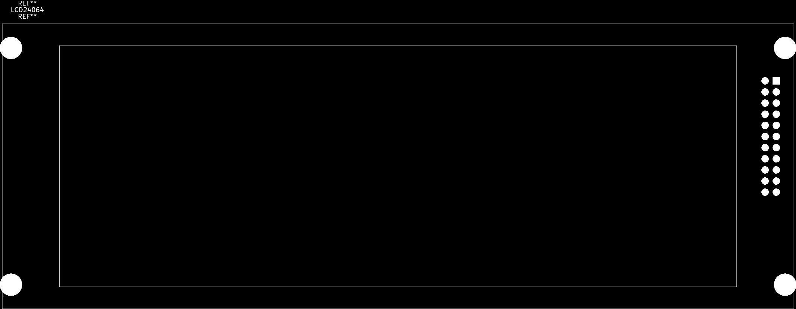
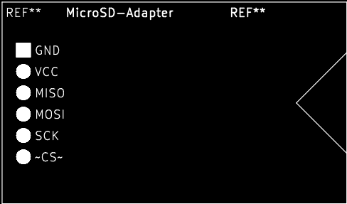
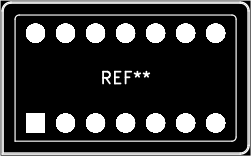
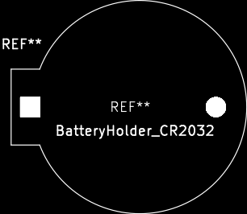
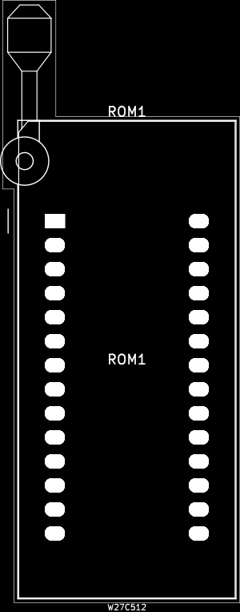

# And3rson's parts library (KiCad/FreeCAD)

I've created those while building my single-board computers and decided to publish it all because:

- It will be easier for me to share them between across projects
- Some people might find them helpful

This listing was generated with [kicad-storybook](https://github.com/and3rson/kicad-storybook).

# Symbols

## my.kicad_sym

| Image | Symbol name | Datasheet | Description |
| --- | --- | --- | --- |
 | CXO_DIP-8-14 |  | Combined symbol for using both DIP-8 and DIP-14 crystal oscillators interchangeably
 | ESP-01 |  | ESP-8266 (ESP-01)
 | ESP-01-v2 |  | ESP-8266 (ESP-01), alternative symbol
 | GAL20V8 |  | Programmable Logic Array, DIP-20, compatible with ATF20V8
 | GAL22V10 | http://web.mit.edu/6.115/www/document/gal22v10.pdf | Programmable Logic Array, compatible with ATF22V10
 | SW_Push_DPDT_R | ~ | Momentary Switch, dual pole double throw
 | SmallJumper |  | None

## 74hc00_small.kicad_sym

| Image | Symbol name | Datasheet | Description |
| --- | --- | --- | --- |
 | 74HC00 | http://www.ti.com/lit/gpn/sn74hc00 | Small NAND gate (to save sheet space)
 | 74HC14_small | http://www.ti.com/lit/gpn/sn74HC14 | Small Schmitt inverter gate (to save sheet space)

## lcd.kicad_sym

| Image | Symbol name | Datasheet | Description |
| --- | --- | --- | --- |
 | 2004A-OLED | https://cdn-shop.adafruit.com/datasheets/WS0010.pdf | HD44780-compatible OLED 20x04 OLED character display (https://www.aliexpress.com/item/32620002089.html, <https://www.telerex-europe.com/content/files/pdfs/productPdfs/WS/OLED/WEH002004AWPP5N00000.pdf)

# Footprints

## footprints.pretty

| Image | Footprint name | Description |
| --- | --- | --- |
 | ESP-01 | ESP-01 (ESP-8266). There are various ways to number ESP-01 pins, but I prefer the JEDEC way of treating GND as pin 4 and VCC as pin 8
 | LCD24064 | https://www.aliexpress.com/item/1005003750084723.html
 | MicroSD-Adapter | MicroSD SPI adapter
 | C_Disc_Long | Ceramic capacitor with bent legs (long distance)
 | 2004A-OLED | 2004A OLED (https://www.aliexpress.com/item/32620002089.html)
 | LCD24064_silk | https://www.aliexpress.com/item/1005003750084723.html
 | C_Disc_Medium | Ceramic capacitor with bent legs (medium distance)
 | Oscillator_DIP-8-14 | DIP-8 / DIP-14 crystal oscillator footprint
 | BatteryHolder_CR2032 | Comfortable Electronic CR2450 battery holder, http://www.comf.com.tw/ProductDetail.asp?no=148
 | ZIF28 | 3M 28-pin zero insertion force socket, through-hole, row spacing 15.24 mm (600 mils), http://multimedia.3m.com/mws/media/494546O/3mtm-dip-sockets-100-2-54-mm-ts0365.pdf
 | C_Disc_VeryLong | Ceramic capacitor with bent legs (very long distance!)

# 3D models

| Image | Model filename | Formats | Description |
| --- | --- | --- | --- |
|  | lcd24064.step | STEP, STL, FreeCAD | T6963C-based 240x64 LCD with character mode - I use it as 40x08 display (<https://www.aliexpress.com/item/1005003750084723.html>) |

