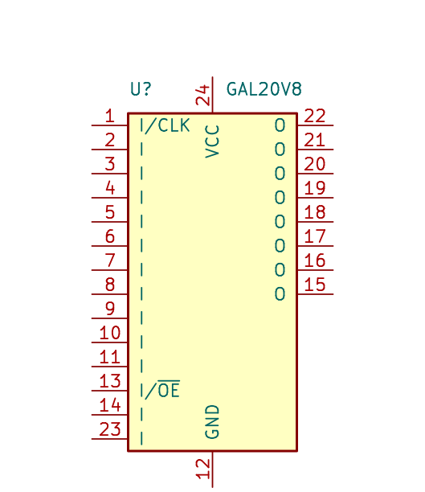

# And3rson's parts library (KiCad/FreeCAD)

I've created those while building my single-board computers and decided to publish it all because:

- It will be easier for me to share them between across projects
- Some people might find them helpful

## Symbols

| Image | Library | Symbol name | Description |
| --- | --- | --- |
|  | my | 74hc00 | Small NAND gate (to save sheet space) |
|  | my | 74hc14_small | Small Schmitt inverter gate (to save sheet space) |
|  | my | cxo_dip-8-14 | Combined symbol for using both DIP-8 and DIP-14 crystal oscillators interchangeably |
|  | my | esp-01 | ESP-8266 (ESP-01) |
|  | my | esp-01-v2 | ESP-8266 (ESP-01), alternative symbol |
|  | my | gal20v8 | GAL20V8 (compatible with ATF20V8) |
|  | my | gal22v10 | GAL22V10 (compatible with ATF22V10) |
|  | my | smalljumper | Small jumper (to save sheet space) |
|  | my | sw_push_dpdt_r | DPDT switch |
|  | lcd | 2004A-OLED | HD44780-compatible OLED 20x04 OLED character display (<https://www.aliexpress.com/item/32620002089.html>) |

## Footprints

| Image | Footprint name | Description |
| --- | --- | --- |
|  | BatteryHolder_CR2032 | |
|  | ESP-01 | There are various ways to number ESP-01 pins, but I prefer the JEDEC way of treating GND as pin 4 and VCC as pin 8 |
|  | LCD24064 | T6963C-based 240x64 LCD with character mode - I use it as 40x08 display (<https://www.aliexpress.com/item/1005003750084723.html>) |
|  | LCD24064 | Visual-only version of above footprint |
|  | 2004A-OLED | HD44780-compatible OLED 20x04 OLED character display (<https://www.aliexpress.com/item/32620002089.html>) |
|  | MicroSD-Adapter | Commonly available microSD adapter with level shifter for 5V SPI operation |
|  | Oscillator_DIP-8-14 | Allows to use both DIP-8 and DIP-14 crystal oscillators |

## 3D models

| Image | Model filename | Formats | Description |
| --- | --- | --- | --- |
|  | lcd24064.step | STEP, STL, FreeCAD | T6963C-based 240x64 LCD with character mode - I use it as 40x08 display (<https://www.aliexpress.com/item/1005003750084723.html>) |

